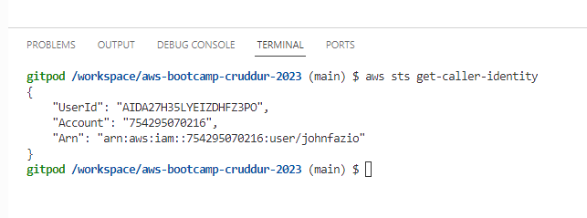
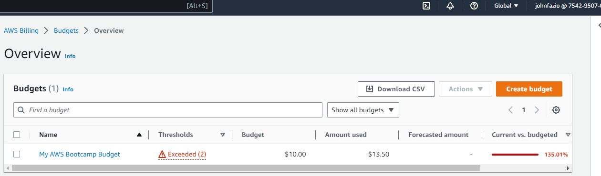
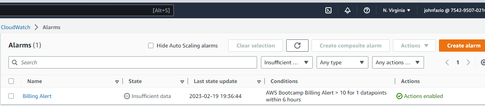

# Week 0 — Billing and Architecture

## Required Homework / Tasks

### Recreate Diagrams in Lucid Charts

I created the conceptual and logical diagrams in Lucid following along with Andrew 

[Cruddur Conceptual Design Diagram](https://lucid.app/lucidchart/a22940b3-a66d-4d8e-b8af-c0f85a563838/edit?viewport_loc=45%2C-116%2C2087%2C985%2C0_0&invitationId=inv_5ec5920c-42bb-45b8-bd3c-5dc44f76e7960)

[Cruddur Logical Design Diagram](https://lucid.app/lucidchart/a4e519aa-039f-4c00-b23c-66b49386e364/edit?viewport_loc=-252%2C304%2C2219%2C1065%2C0_0&invitationId=inv_046fae6f-acac-4600-b8e7-96ab94b3d8e8)

### Install and Verify AWS CLI

I was able to install AWS CLI in Chrome using GitPod

### Create Budget and set Billing Alert

I watched Chirag's video and created a budget and setup a billing alert in AWS/Cloudwatch

## Homework Challenges

Considering I am already 5 days late I am going to work out the Homework Challenges at a later time.  While Red Squad status would be nice, I'm afraid of falling too far behind so early in the course.

