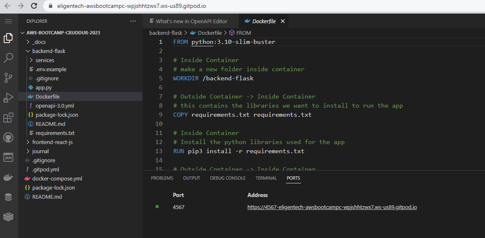
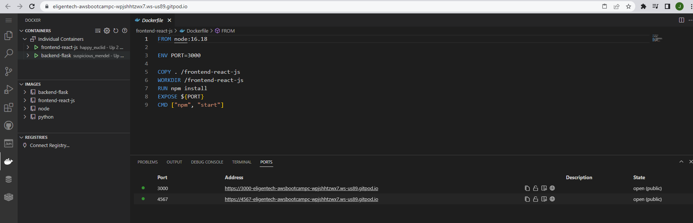
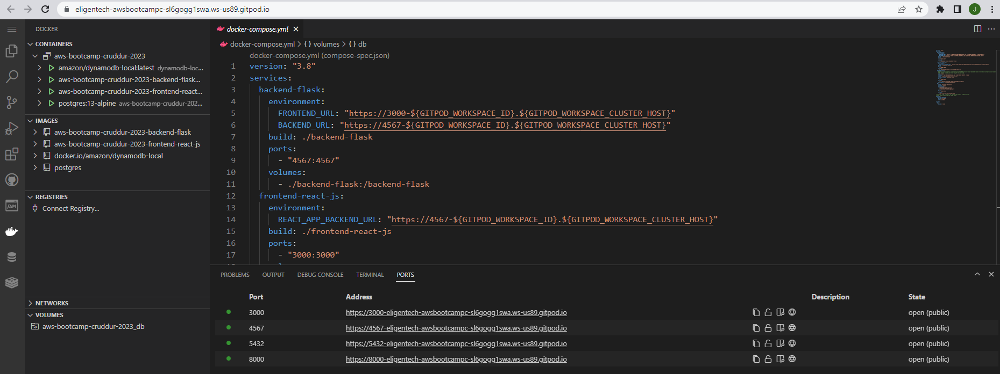
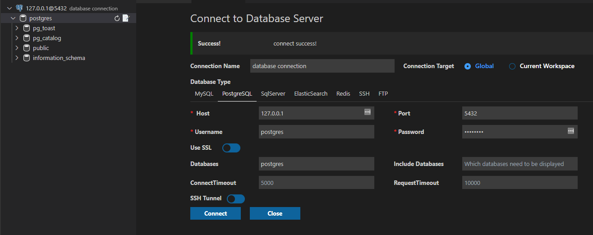
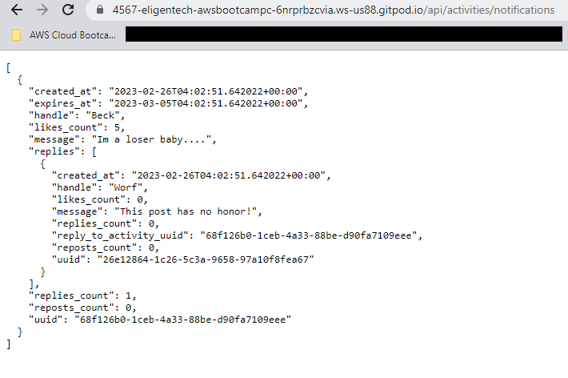
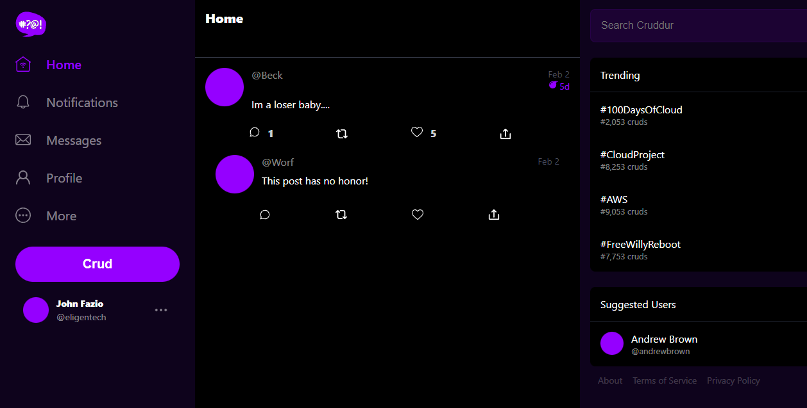

# Week 1 — App Containerization

## Required Homework / Tasks

### Containerize Backend-flask and Frontend-react

I followed Andrew's Week1 video and containerized each individually:

I first containerized backend-flask with it's own dockerfile

I next containerized containerized frontend-react-js with its own dockerfile 

### Create docker-compose file to run multiple containers

I created the docker-compose file to run backend-flask and frontend-react-js (this screenshot also has the dynamodb and postgres databases and client included in the configuration.

### Add DynamoDB Local and Postgres

I did watch the follow up video "Week 1 - DynamoDB and Postgres vs Docker" and was able to walk through the steps with Andrew in order to create the dynamodb local and postgres databases.  

I was able to connect to the postgres SQL database server

I was also able to create and connect to the dynamodb local database, create the table Music, and add the records (copy/paste from 100daysofcloud repo) but I didn't  take any screenshots of the proof when running the terminal commands.

### Create the Notifications Feature

I followed along with Andrew's followup video "Week 1 - Create the notification feature (Backend and Front)" and was able to successfully implement the Notifications feature in Cruddur with the dummy data.

## Homework Challenges
Still behind on the coursework.......
