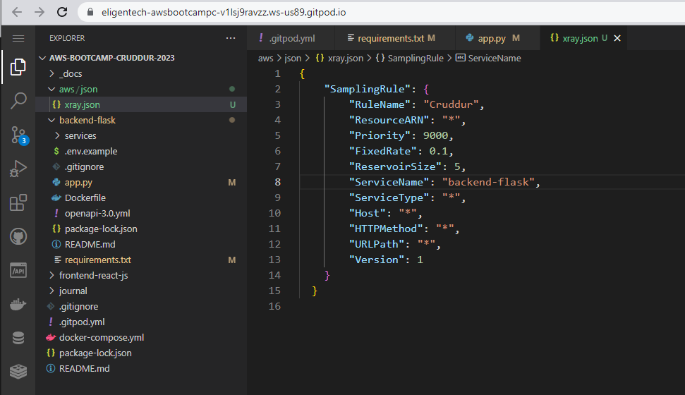

# Week 2 — Distributed Tracing

## Required Homework / Tasks

### Instrument Honeycomb.io with (OTEL) into the backend-flask application
I followed along with Andrew's Week 2 class, signed up for Honeycomb.io and added the Honeycomb.io code to connect it to my backend-flask/app.py file:

### Run queries to explore traces within Honeycomb.io
I followed along, created a trace, and added the multispan trace as Jessica Kerr suggested:

### Added npm i to gitpod.yml for frontend-flask-js
I had wondered why we hadn't done this before so I'm glad we added it to gitpod.yml

### Instrument AWS X-Ray into backend flask application

### Configure and provision X-Ray daemon within docker-compose and send data back to X-Ray API

### Observe X-Ray traces within the AWS Console

### Integrate Rollbar for Error Logging

### Trigger an error an observe an error with Rollbar

### Install WatchTower and write a custom logger to send application log data to CloudWatch Log group

