# Week 2 — Distributed Tracing

## Required Homework / Tasks

### Instrument Honeycomb.io with (OTEL) into the backend-flask application
I followed along with Andrew's Week 2 class, signed up for Honeycomb.io and added the Honeycomb.io code to connect it to my backend-flask/app.py file:
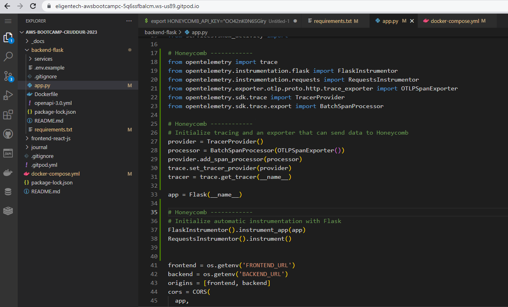

### Run queries to explore traces within Honeycomb.io
I followed along, created a trace, and added the multispan trace as Jessica Kerr suggested:
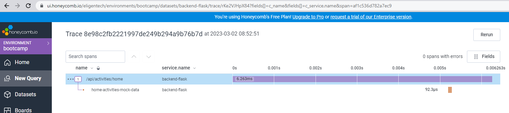

### Added npm i to gitpod.yml for frontend-flask-js
I had wondered why we hadn't done this before so I'm glad we added it to gitpod.yml
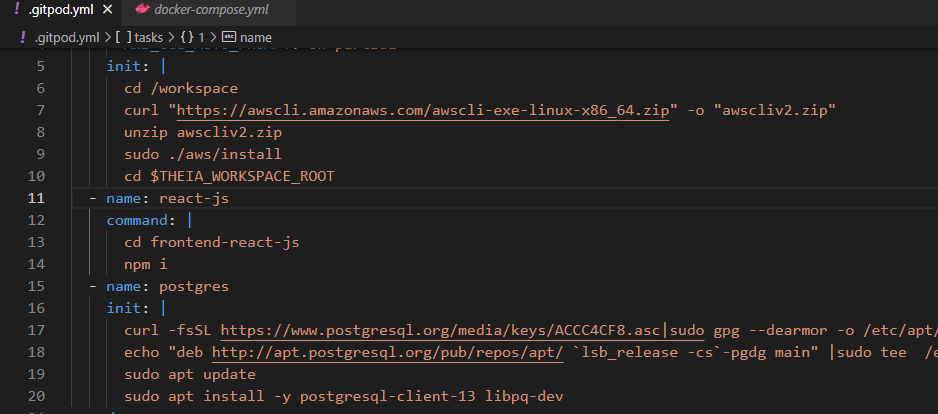

### Instrument AWS X-Ray into backend flask application
I watched and followed along with Andrew's follow-up video on X-Ray, created the required xray-json file.....
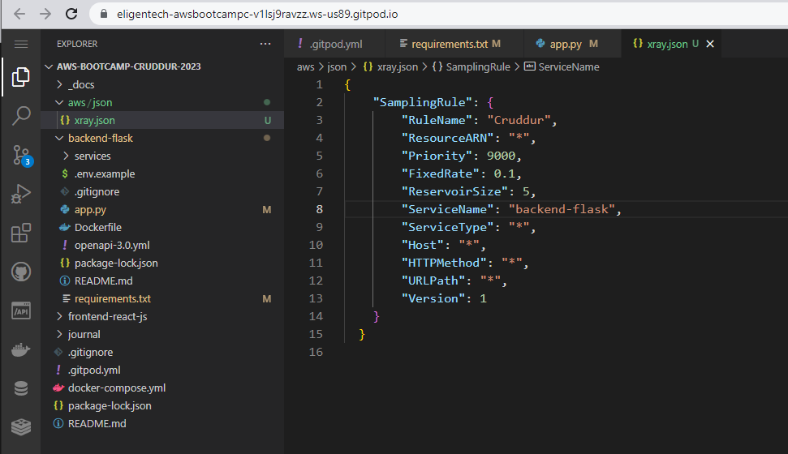

...and created a crudder group in X-Ray from the Terminal
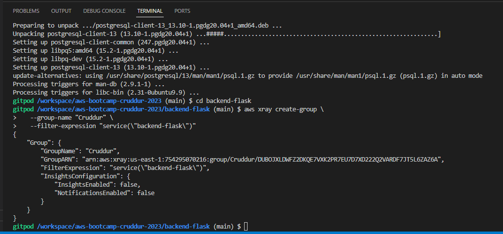

### Configure and provision X-Ray daemon within docker-compose and send data back to X-Ray API
I added the x-ray Daemon code into docker-compose to provision the X-Ray daemon:
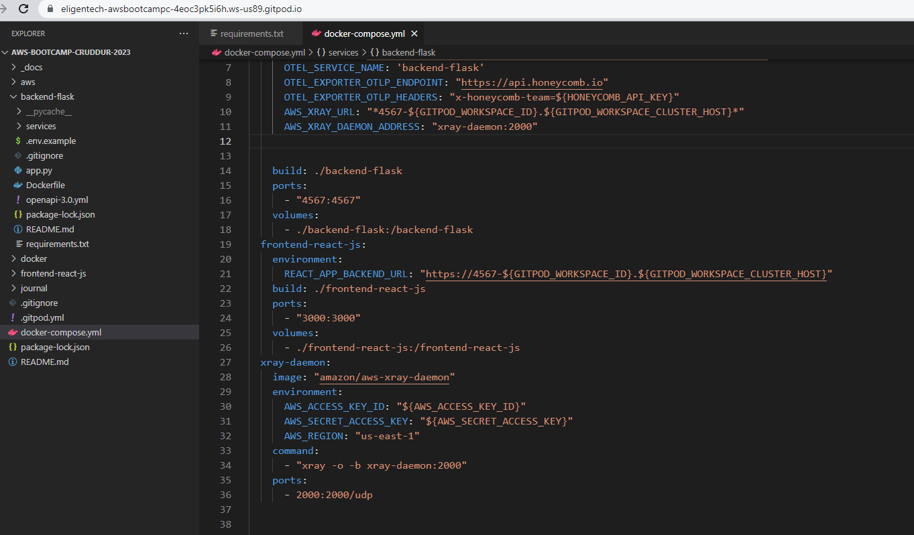

### Observe X-Ray traces within the AWS Console
After running Compose UP on docker-compose, opening up the backend in my browser, and hitting refresh a few times I started to see data coming through into the AWS X-Ray Console.
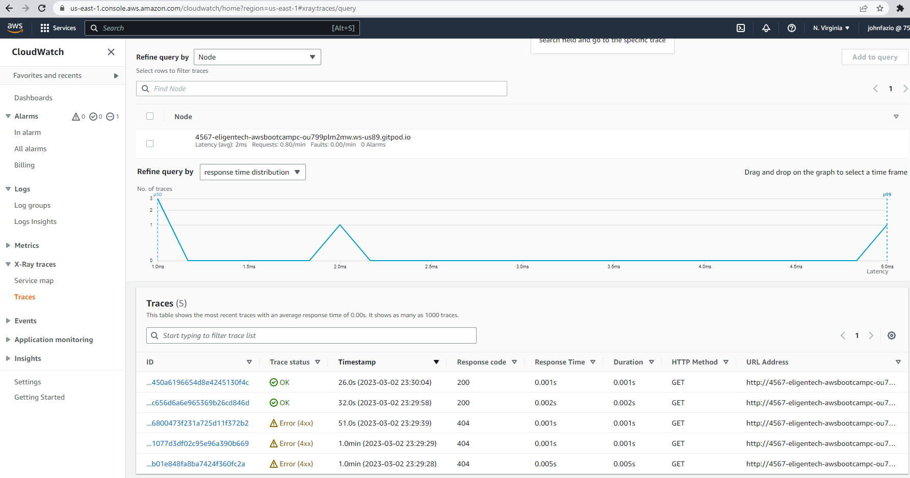

Tracet map of data:
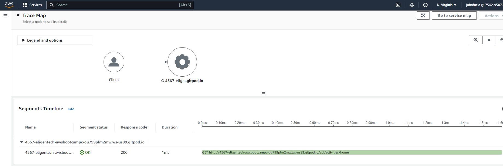

After we added code to track subsegment activity it started to show up in the console to:
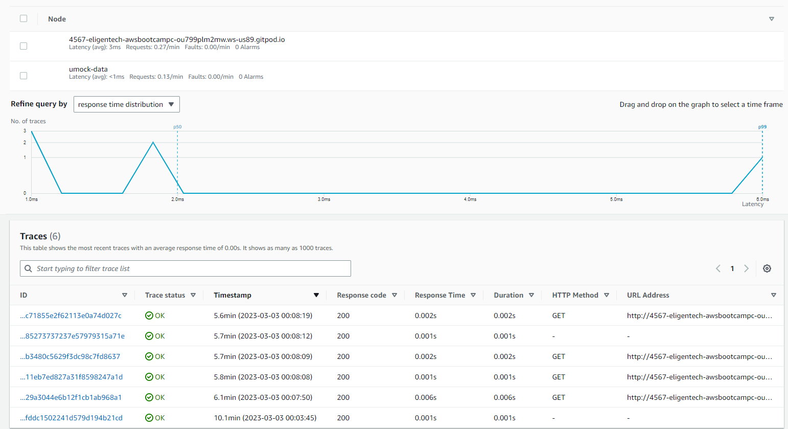

### Integrate Rollbar for Error Logging
I followed Andrew's follow-up Rollbar video and add the rollbar instrumentation to backend-flask app.py
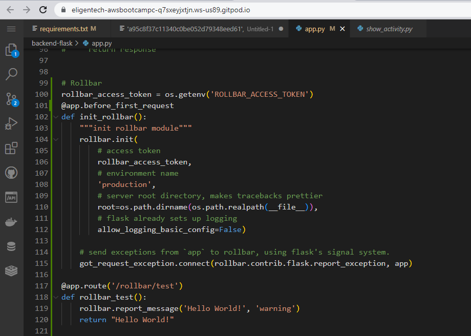

Initially, Rollbar did not connect to my backend-flask instance and after investigation I saw that when docker-compose was running there was a warning about the not receiving a value for the rollbar_access_token even though I set the env vars..and that the value was set to the default which was blank.  

I didn't take a screenshot of that, but when I attached terminal to the backend-flask docker container "env | grep ROLL" didn't show the rollbar token.  After committing and deleting my gitpod workspace and starting a new one, the env vars were passed and Rollbar connected.  

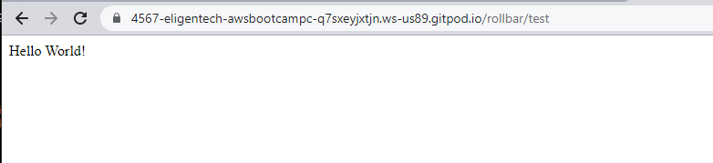

Once the env vars were being passed, rollbar started receiving data and showing stats:
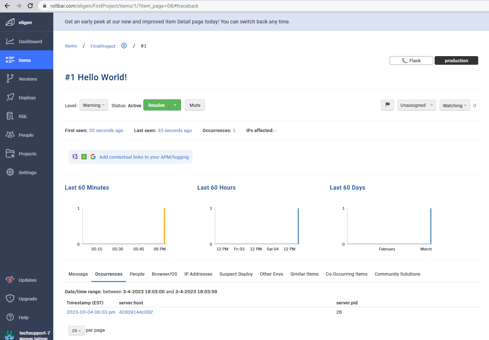

### Trigger an error an observe an error with Rollbar
After confirming that Rollbar was connected and receiving data, we janked the code by removing code from home_activities.py
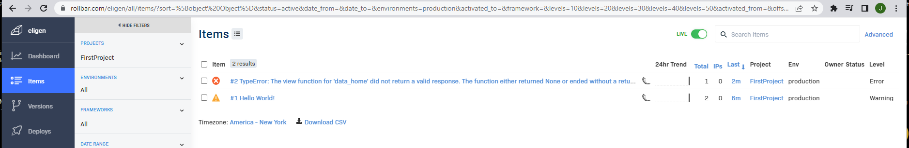

Clicking the error showed more detail:
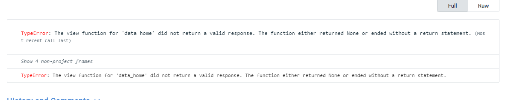

I also received an email from Rollbar with an alert regarding the error:
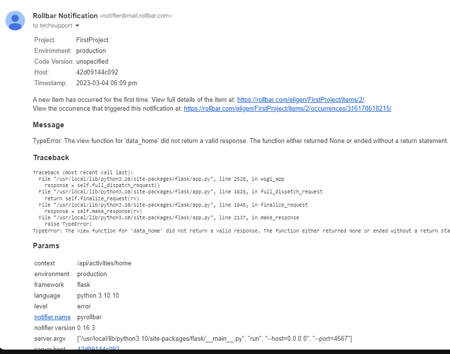

### Install WatchTower and write a custom logger to send application log data to CloudWatch Log group
Following Andrew's Cloudwatch video I was able to install and configure Watchtower, and send data to the AWS Cloudwatch.
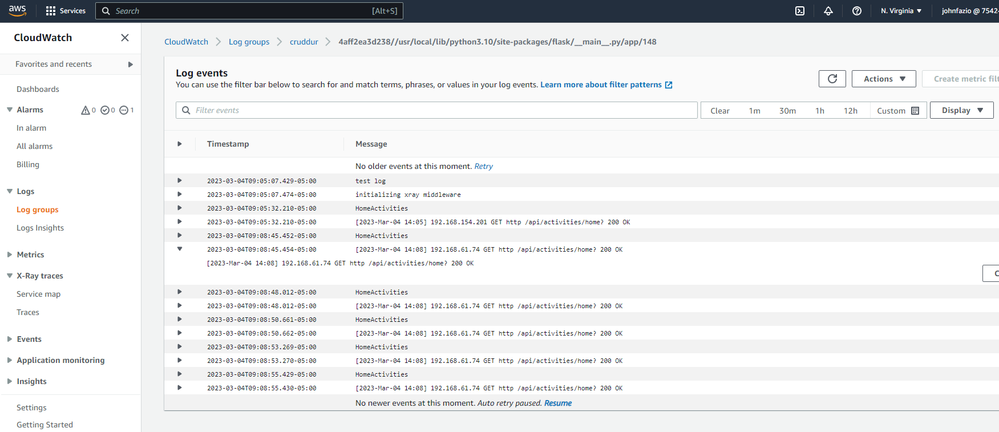
